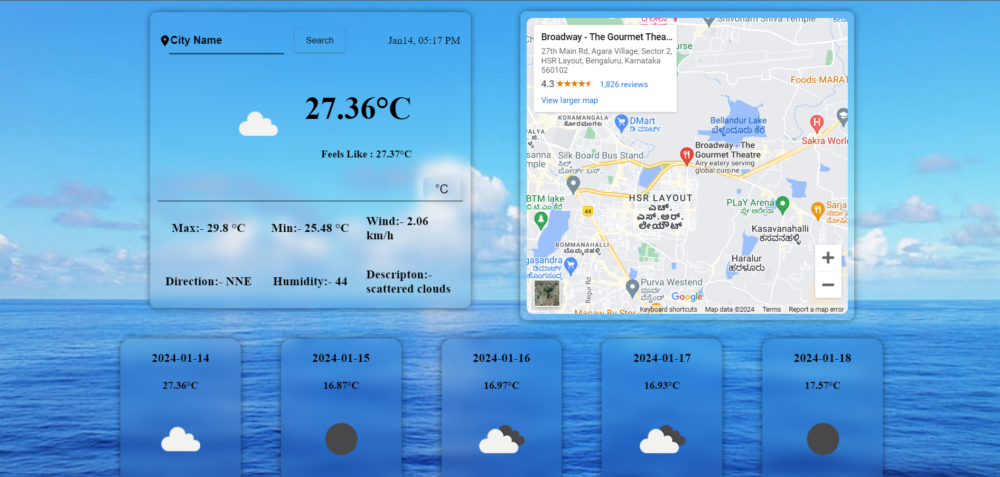

# Weather Forecast Application

This single-page weather forecast application allows users to check the current weather details and a 5-day forecast for a selected city. The application utilizes the OpenWeatherMap API for weather data retrieval.

### Deployed Link

[Weather Forecast App - Live Demo](https://weather-app-tau-nine-55.vercel.app/)

## Features

### 1. Current Weather Details

Users can enter a city name to view the current weather details, including:

- Current Temperature
- Minimum and Maximum Temperature
- Humidity
- Wind Speed and Direction
- Description of the Weather
- Weather Icon reflecting the current conditions

### 2. 5-Day Forecast

The application provides a 5-day forecast for the selected city, displaying:

- Date
- Average Temperature
- Description of the Weather
- Weather Icon

### 3. Unit Conversion

Users can toggle between Celsius and Fahrenheit to view temperature details in their preferred units.

## Technical Details

The application is implemented using HTML, CSS, and JavaScript with the ReactJS library. The code follows best practices, ensuring maintainability and readability.

### File Structure

- **src/components/**: Contains React components.
  - **Day.jsx**: Component for entering the city name and fetching weather data.
  - **FiveDay.js**: Component to display weather details for next five days.
  - **Map.js**: Component to display the Map of the selected city.
  
- **src/Context/**: Contains the API service for fetching weather data.
  - **Context.jsx**: To Handle all the API calls.
- **src/styles/**: Holds CSS files for styling.
  - **App.module.css**: Global styles for the application.
  

### Responsive Design

The application is designed to look and function well on both desktop and mobile devices. Responsive CSS ensures a seamless user experience across various screen sizes.

#### Desktop View

#### Mobile View

### Error Handling

Clear error messages are displayed for scenarios such as invalid city names or API errors, providing a user-friendly experience.

## How to Run

1. Clone the repository.
2. Install dependencies using `npm install`.
3. Obtain an API key from [OpenWeatherMap](https://openweathermap.org/api) and replace the placeholder in **WeatherService.js**.
4. Run the application using `npm run dev`.

Feel free to explore the codebase, make improvements, and contribute to the development of this weather forecast application. If you encounter any issues or have suggestions, please open an issue or submit a pull request.

Happy forecasting! 🌦️
